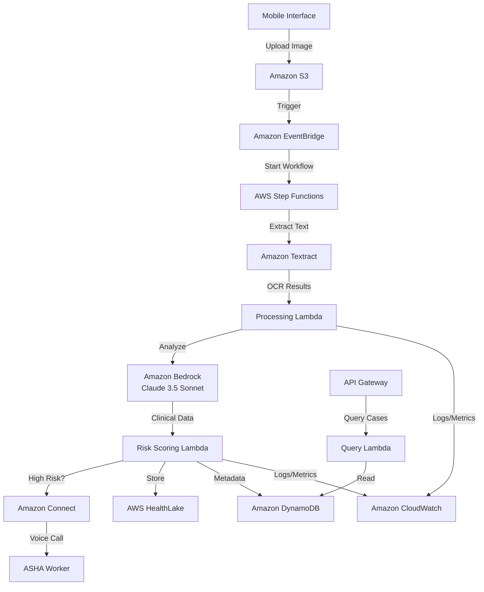

# Design Document: NurScribe Clinical Bridge

## Overview

NurScribe is a serverless AWS-based healthcare system that transforms handwritten English discharge summaries into actionable vernacular healthcare guidance for rural health workers in India. The system uses a multi-stage pipeline: image upload → OCR → AI clinical analysis → risk scoring → automated outreach → FHIR storage.

The architecture follows event-driven serverless patterns, using AWS Lambda for compute, S3 for storage, DynamoDB for state management, and Step Functions for workflow orchestration. The system prioritizes scalability, security, and compliance with healthcare standards.

## Architecture

### High-Level Architecture



### Workflow Orchestration

The system uses AWS Step Functions to orchestrate the multi-stage processing pipeline:

1. **Upload Stage**: Image uploaded to S3, case created in DynamoDB
2. **OCR Stage**: Textract extracts text, validates confidence scores
3. **Analysis Stage**: Bedrock analyzes clinical content, extracts entities
4. **Risk Scoring Stage**: Risk level assigned based on clinical indicators
5. **Outreach Stage**: High-risk cases trigger Amazon Connect calls
6. **Storage Stage**: FHIR resources created and stored in HealthLake
7. **Completion Stage**: Case status updated, metrics published

Each stage can retry on failure and has error handling paths.

## Components and Interfaces

### 1. Mobile Upload Interface

**Technology**: Static web application hosted on S3 + CloudFront, using AWS Amplify for authentication

**Responsibilities**:
- Provide mobile-responsive UI for image capture/upload
- Authenticate healthcare workers using Cognito
- Upload images directly to S3 using pre-signed URLs
- Display upload status and case tracking

**API Endpoints**:
- `POST /api/upload/presigned-url` - Get pre-signed S3 URL for upload
- `GET /api/cases/{caseId}` - Retrieve case status and details
- `GET /api/cases` - List cases with filtering

**Interface**:
```typescript
interface UploadRequest {
  fileName: string;
  fileSize: number;
  mimeType: string;
  metadata: {
    facilityId: string;
    uploaderId: string;
    patientIdentifier?: string;
  };
}

interface UploadResponse {
  caseId: string;
  uploadUrl: string;
  expiresIn: number;
}
```

### 2. OCR Processing Service

**Technology**: AWS Lambda triggered by S3 events, calling Amazon Textract

**Responsibilities**:
- Receive S3 upload notifications
- Invoke Textract for handwriting OCR
- Validate OCR confidence scores
- Store raw OCR output
- Trigger next stage or flag for manual review

**Interface**:
```typescript
interface OCRResult {
  caseId: string;
  extractedText: string;
  confidence: number;
  blocks: TextractBlock[];
  requiresManualReview: boolean;
}

interface TextractBlock {
  text: string;
  confidence: number;
  boundingBox: BoundingBox;
  blockType: 'LINE' | 'WORD';
}
```

### 3. Clinical Analysis Service

**Technology**: AWS Lambda calling Amazon Bedrock with Claude 3.5 Sonnet

**Responsibilities**:
- Receive OCR text
- Construct clinical analysis prompt
- Extract structured clinical entities
- Parse and validate AI response
- Store structured clinical data

**Prompt Structure**:
```
You are a clinical AI assistant analyzing a discharge summary from a district hospital in India.

Extract the following information:
1. Patient demographics (name, age, gender)
2. Primary diagnosis
3. Secondary diagnoses
4. Medications prescribed with dosages
5. Procedures performed
6. Follow-up instructions
7. Warning signs to watch for

Discharge Summary Text:
{ocr_text}

Respond in JSON format with structured fields.
```

**Interface**:
```typescript
interface ClinicalAnalysis {
  caseId: string;
  patient: {
    name?: string;
    age?: number;
    gender?: string;
  };
  diagnoses: Diagnosis[];
  medications: Medication[];
  procedures: Procedure[];
  followUpInstructions: string[];
  warningSigns: string[];
  rawAIResponse: string;
}

interface Diagnosis {
  code?: string;
  display: string;
  isPrimary: boolean;
}

interface Medication {
  name: string;
  dosage?: string;
  frequency?: string;
  duration?: string;
}

interface Procedure {
  name: string;
  date?: string;
}
```

### 4. Risk Scoring Service

**Technology**: AWS Lambda with rule-based scoring algorithm

**Responsibilities**:
- Receive clinical analysis
- Apply risk scoring rules
- Assign risk level (Low, Medium, High, Critical)
- Determine if outreach is needed
- Trigger outreach workflow for high-risk cases

**Risk Scoring Algorithm**:
```
Base Score = 0

Add points for:
- Age > 65: +2
- Age < 5: +2
- Chronic conditions (diabetes, hypertension, heart disease): +2 each
- Recent surgery: +3
- Multiple medications (>5): +2
- Specific warning signs (fever, bleeding, breathing difficulty): +3 each

Risk Levels:
- Low: 0-3 points
- Medium: 4-6 points
- High: 7-10 points
- Critical: 11+ points

Outreach Trigger: High or Critical
```

**Interface**:
```typescript
interface RiskAssessment {
  caseId: string;
  riskScore: number;
  riskLevel: 'Low' | 'Medium' | 'High' | 'Critical';
  riskFactors: string[];
  requiresOutreach: boolean;
}
```

### 5. Outreach Service

**Technology**: AWS Lambda integrating with Amazon Connect

**Responsibilities**:
- Receive high-risk case notifications
- Look up ASHA worker contact information
- Translate clinical instructions to vernacular language
- Generate voice call script
- Initiate Amazon Connect outbound call
- Handle call retries and fallback SMS

**Translation Approach**:
- Use Amazon Bedrock to translate clinical instructions
- Maintain glossary of medical terms in Marathi/Hindi
- Use Amazon Polly for text-to-speech in vernacular languages

**Interface**:
```typescript
interface OutreachRequest {
  caseId: string;
  ashaWorker: {
    id: string;
    name: string;
    phoneNumber: string;
    preferredLanguage: 'marathi' | 'hindi';
  };
  clinicalSummary: {
    patientName: string;
    riskLevel: string;
    keyDiagnoses: string[];
    careInstructions: string[];
    warningSigns: string[];
  };
}

interface OutreachResult {
  caseId: string;
  callId: string;
  status: 'completed' | 'no_answer' | 'failed';
  attempts: number;
  timestamp: string;
  duration?: number;
}
```

### 6. FHIR Transformation Service

**Technology**: AWS Lambda with FHIR R4 library

**Responsibilities**:
- Receive clinical analysis and risk assessment
- Transform data into FHIR R4 resources
- Validate FHIR compliance
- Submit resources to AWS HealthLake
- Handle validation errors

**FHIR Resources Created**:
- **Patient**: Demographics and identifiers
- **Encounter**: Hospital discharge encounter
- **Condition**: Diagnoses with severity
- **MedicationStatement**: Prescribed medications
- **Procedure**: Procedures performed
- **RiskAssessment**: Computed risk score and level

**Interface**:
```typescript
interface FHIRBundle {
  resourceType: 'Bundle';
  type: 'transaction';
  entry: FHIRBundleEntry[];
}

interface FHIRBundleEntry {
  resource: FHIRResource;
  request: {
    method: 'POST' | 'PUT';
    url: string;
  };
}
```

### 7. Case Management Service

**Technology**: AWS Lambda with DynamoDB

**Responsibilities**:
- Create and update case records
- Track case status through workflow stages
- Store audit trail of all operations
- Provide query API for case retrieval
- Manage case metadata

**DynamoDB Schema**:
```typescript
interface CaseRecord {
  caseId: string; // Partition Key
  createdAt: string; // Sort Key
  status: 'uploaded' | 'ocr_processing' | 'analyzing' | 'risk_scored' | 'outreach_pending' | 'completed' | 'failed';
  facilityId: string;
  uploaderId: string;
  s3Key: string;
  ocrConfidence?: number;
  riskLevel?: string;
  fhirPatientId?: string;
  outreachStatus?: string;
  lastUpdated: string;
  auditTrail: AuditEntry[];
}

interface AuditEntry {
  timestamp: string;
  stage: string;
  status: string;
  details?: string;
}
```

### 8. API Gateway

**Technology**: Amazon API Gateway (REST API)

**Endpoints**:
- `POST /upload/presigned-url` - Get upload URL
- `GET /cases/{caseId}` - Get case details
- `GET /cases` - List cases with pagination
- `GET /cases/{caseId}/audit` - Get audit trail
- `POST /cases/{caseId}/retry` - Retry failed case

**Authentication**: AWS Cognito User Pools with JWT tokens

## Data Models

### Case State Machine

```
uploaded → ocr_processing → analyzing → risk_scored → outreach_pending → completed
                ↓               ↓            ↓              ↓
              failed         failed       failed        failed
```

### S3 Bucket Structure

```
nurscribe-uploads/
  {facilityId}/
    {year}/
      {month}/
        {caseId}/
          original.jpg
          ocr-result.json
          clinical-analysis.json
          risk-assessment.json
```

### DynamoDB Tables

**Cases Table**:
- Partition Key: `caseId`
- Sort Key: `createdAt`
- GSI: `facilityId-createdAt-index` for facility queries
- GSI: `status-createdAt-index` for status filtering

**ASHA Workers Table**:
- Partition Key: `workerId`
- Attributes: name, phoneNumber, preferredLanguage, facilityIds[]

## Correctness Properties

A property is a characteristic or behavior that should hold true across all valid executions of a system—essentially, a formal statement about what the system should do. Properties serve as the bridge between human-readable specifications and machine-verifiable correctness guarantees.

### Property 1: Image Validation Consistency

*For any* file submitted to the upload interface, if the file format is valid (JPEG, PNG) and size is within limits (< 10MB), then validation should pass; otherwise validation should fail with a specific error code.

**Validates: Requirements 1.2**

### Property 2: Case ID Uniqueness

*For any* set of image uploads processed by the system, all generated case identifiers must be unique across the entire system.

**Validates: Requirements 1.4**

### Property 3: Workflow Stage Progression

*For any* case that successfully completes a processing stage (OCR, analysis, risk scoring), the system should automatically trigger the next appropriate stage based on the workflow state machine.

**Validates: Requirements 2.1, 2.5, 3.5**

### Property 4: Data Persistence with Case Association

*For any* processing result (OCR output, clinical analysis, risk assessment), when stored, it must be associated with the correct case identifier and retrievable via that identifier.

**Validates: Requirements 2.3, 3.4**

### Property 5: Low Confidence Flagging

*For any* OCR result with confidence score below 60%, the case must be flagged with `requiresManualReview: true` and not proceed to automated clinical analysis.

**Validates: Requirements 2.4**

### Property 6: Clinical Analysis Structure Completeness

*For any* successful clinical analysis result, the output must contain all required fields: diagnoses array, medications array, procedures array, followUpInstructions array, and warningSigns array (arrays may be empty but must exist).

**Validates: Requirements 3.2**

### Property 7: Risk Level Assignment

*For any* clinical analysis input, the risk scorer must assign exactly one risk level from the set {Low, Medium, High, Critical} based on the defined scoring algorithm.

**Validates: Requirements 3.3**

### Property 8: High-Risk Outreach Triggering

*For any* case with risk level of High or Critical, the system must set `requiresOutreach: true` and initiate the outreach workflow.

**Validates: Requirements 3.5**

### Property 9: Language Selection Consistency

*For any* ASHA worker with a defined `preferredLanguage` field, when an outreach call is initiated, the system must use that language for translation and text-to-speech.

**Validates: Requirements 4.2**

### Property 10: Voice Message Content Completeness

*For any* outreach voice message generated, the message must include patient name, risk level, at least one diagnosis, and at least one care instruction (if available in the clinical analysis).

**Validates: Requirements 4.3**

### Property 11: Retry Logic Compliance

*For any* outreach call that fails or is not answered, the system must retry up to 3 times with 30-minute intervals between attempts, tracking the attempt count.

**Validates: Requirements 4.5**

### Property 12: FHIR Transformation Validity

*For any* clinical analysis with patient demographics and diagnoses, the FHIR transformation must produce a valid FHIR R4 Bundle that passes FHIR schema validation.

**Validates: Requirements 5.1, 5.4**

### Property 13: FHIR Resource Type Coverage

*For any* clinical analysis containing specific data types (patient info, diagnoses, medications, procedures), the corresponding FHIR resource types (Patient, Condition, MedicationStatement, Procedure) must be created in the FHIR bundle.

**Validates: Requirements 5.2**

### Property 14: Case Initialization Completeness

*For any* new case created, the case record must contain caseId, createdAt timestamp, initial status ('uploaded'), facilityId, uploaderId, and an empty auditTrail array.

**Validates: Requirements 6.1**

### Property 15: Status Transition Logging

*For any* case status change, the system must append an audit entry to the auditTrail with timestamp, stage name, new status, and optional details.

**Validates: Requirements 6.2**

### Property 16: Outreach Metadata Recording

*For any* outreach call initiated, the system must record call metadata including callId, timestamp, status, and attempt number in the case record.

**Validates: Requirements 6.3**

### Property 17: Error Logging with Context

*For any* system error that occurs during case processing, the error must be logged with the associated caseId, error message, and stack trace.

**Validates: Requirements 6.4**

### Property 18: Audit Trail Queryability

*For any* case in the system, the complete audit trail must be retrievable via the API endpoint `/cases/{caseId}/audit` and contain all state transitions in chronological order.

**Validates: Requirements 6.5**

### Property 19: Access Control Enforcement

*For any* API request to access patient data, if the requesting user does not have the required role permissions, the request must be rejected with a 403 Forbidden status.

**Validates: Requirements 7.3**

### Property 20: Metrics Publication

*For any* critical operation (OCR processing, clinical analysis, risk scoring, outreach), the system must publish at least one metric to CloudWatch indicating operation completion and duration.

**Validates: Requirements 9.1**

### Property 21: Clinical Instruction Translation

*For any* clinical instruction in English and a target vernacular language (Marathi or Hindi), the translation service must produce output text in the target language.

**Validates: Requirements 10.2**

## Error Handling

### Error Categories

1. **Validation Errors**: Invalid input data (image format, size, missing fields)
   - Response: 400 Bad Request with specific error message
   - Action: Return error to user, do not create case

2. **Processing Errors**: OCR failure, AI service errors, FHIR validation failure
   - Response: Update case status to 'failed', log error with context
   - Action: Flag for manual review, send admin notification

3. **Integration Errors**: AWS service unavailability (S3, Textract, Bedrock, HealthLake)
   - Response: Retry with exponential backoff (3 attempts)
   - Action: If all retries fail, mark case as failed and alert admins

4. **Outreach Errors**: Call failure, no answer, SMS delivery failure
   - Response: Implement retry logic (3 attempts, 30-min intervals)
   - Action: After exhausting retries, send SMS fallback and admin alert

### Error Recovery Strategies

- **Idempotent Operations**: All Lambda functions designed to be idempotent for safe retries
- **Dead Letter Queues**: Failed events sent to DLQ for manual investigation
- **Circuit Breaker**: Temporarily disable outreach if Connect service shows high failure rate
- **Graceful Degradation**: If HealthLake is unavailable, store FHIR data in S3 for later ingestion

### Error Monitoring

- CloudWatch alarms for error rate thresholds (>5%)
- SNS notifications for critical failures
- Dashboard showing error distribution by stage and type

## Testing Strategy

### Unit Testing

Unit tests will verify specific examples and edge cases for individual components:

- **Validation Logic**: Test image format validation with valid/invalid formats
- **Risk Scoring**: Test scoring algorithm with specific clinical scenarios
- **FHIR Transformation**: Test transformation with sample clinical data
- **Error Handling**: Test error paths with simulated failures
- **State Transitions**: Test case status updates with specific state changes

### Property-Based Testing

Property-based tests will verify universal properties across all inputs using **fast-check** (for TypeScript/JavaScript) or **Hypothesis** (for Python components):

- **Minimum 100 iterations** per property test to ensure comprehensive coverage
- Each property test tagged with: **Feature: nurscribe-clinical-bridge, Property {N}: {property_text}**
- Properties will test invariants, round-trip behaviors, and error conditions

**Key Property Tests**:
- Case ID uniqueness across random upload batches
- Risk level assignment for randomly generated clinical data
- FHIR validation for randomly generated clinical analyses
- Workflow progression for random case states
- Audit trail completeness for random operation sequences

### Integration Testing

Integration tests will verify end-to-end workflows:

- Upload → OCR → Analysis → Risk Scoring → Storage (happy path)
- High-risk case → Outreach triggering
- Failed OCR → Manual review flagging
- FHIR validation failure → Error handling

### AWS Service Mocking

For local testing, use:
- **LocalStack** for S3, DynamoDB, EventBridge
- **Mock Bedrock responses** with sample clinical analyses
- **Mock Textract responses** with sample OCR outputs
- **Mock Connect calls** to verify outreach logic without actual calls

### Test Data

- Sample handwritten discharge summaries (anonymized)
- Synthetic clinical data covering various risk levels
- ASHA worker profiles with different language preferences
- Edge cases: empty fields, malformed data, extreme values

